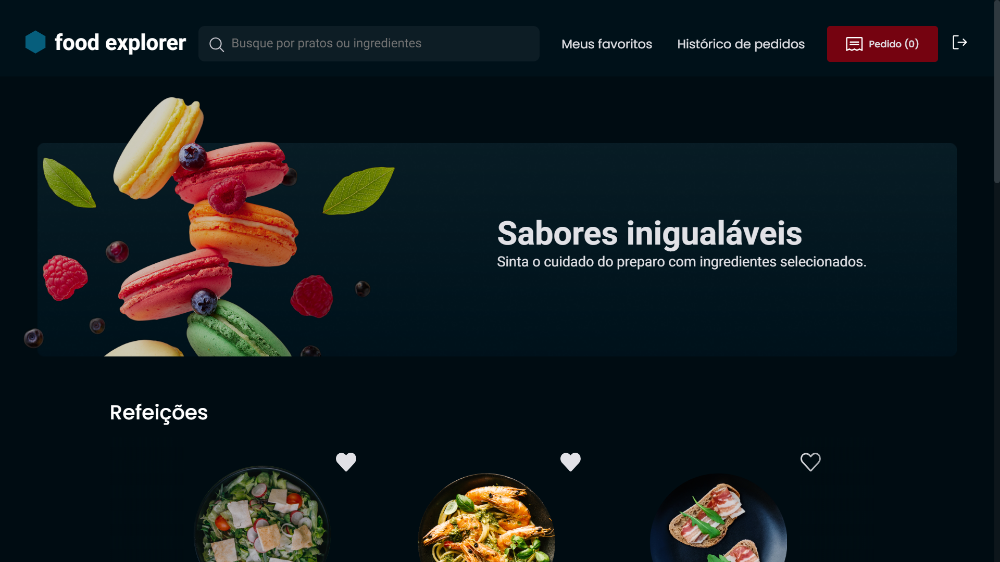

# Food Explorer

Food Explorer is an interactive menu application for restaurant sales. It allows users to view available food plates, obtain detailed information about each of them and place orders. The admin has access to additional features, such as the ability to add, edit and delete food plates from the menu, can manage orders individually and update the status in "Pendente", "Preparando" e "Entregue".



## Functionalities

- Login is done with JWT (JSON Web Tokens) to access the system.
- Both, the user and the admin, can search for food plates by name or ingredients.
- Table for viewing orders with search option by code or status.

### admin

- Can register food plates with name, category, description, ingredients, price and image upload.
- Manage orders and change status, in addition, to editing data, image and delete food plates.

### User

- Visualization of all food Plates registered in the menu.
- Add food plates to the cart.
- Control of the amount of items in the cart.
- Delete food plates from the cart.
- Mark food plates as favorites.
- View order, total sum and payment methods.

## Technologies

- `React.js`
- `TypeScript`
- `Styled-Components`
- `React-Router-Dom`
- `React-Hook-Form`
- `Tanstack-Query`
- `Axios`

## Installation

```bash
# Clonar repositório
$ git clone https://github.com/EmanuelQuintino/Food-Explorer.git

# Instalar dependências
$ npm install

# Executar projeto
$ npm run dev
```

## Links

- [Deploy](https://project-food-explorer.netlify.app/)
- [Repositório da API](https://github.com/EmanuelQuintino/Food-Explorer-API)
